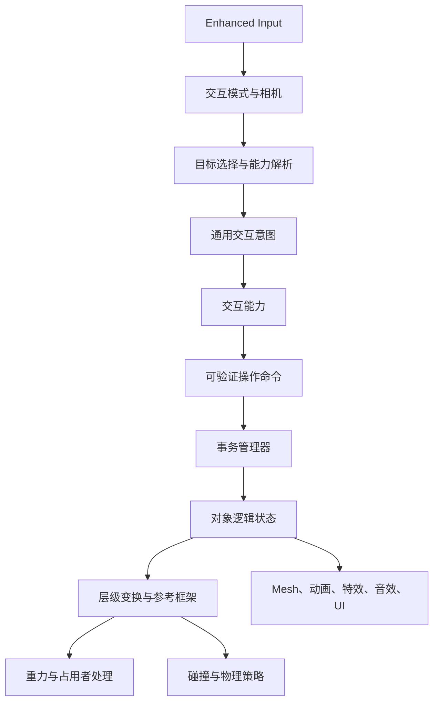

# DreamSpace 可交互建筑世界技术方案

> 文档状态：初版方案
> 目标引擎：Unreal Engine 5
> 目标实现方式：以 C++ 为核心，蓝图承担资产配置和表现编排
> 适用范围：第三人称探索视角、全局建筑操作视角，以及两种视角之间共享的世界状态

## 1. 方案目标

项目的核心玩法是：玩家可以在第三人称视角和全局视角之间切换，并在全局视角对建筑或建筑的一部分执行旋转、缩放、破坏、拆分、移动等操作。这些操作会改变第三人称视角下的真实世界，包括建筑内部的空间关系、玩家位置、物体朝向、碰撞和重力方向。

策划后续可能继续增加新的操作，美术提供的对象也可能从完整建筑、建筑局部到独立物件不等。系统需要让“新增一个可交互对象”主要变成资产配置和关卡摆放工作；当出现全新的行为时，也应只新增一个可复用的能力模块，而不是为每个对象复制一套逻辑。

本方案的目标是建立一个可组合、数据驱动、以对象状态为中心的交互运行时。方案保留实现选择，不展开到具体类的全部成员和函数实现。

### 1.1 设计原则

1. **对象状态是唯一事实来源。** 物体当前的变换、部件状态、破坏状态和重力参考方向由逻辑状态保存，场景组件负责表现这些状态。
2. **变换必须有层级和坐标系。** 建筑整体、建筑局部、建筑内部物体都使用相对父节点的局部变换，避免把世界坐标散落到各个类中。
3. **行为使用能力组合。** 旋转、缩放、拾取、破坏、重力策略等作为可复用能力挂载到对象或部件上。
4. **输入、规则和效果分离。** 输入只表达玩家意图；目标解析和能力决定能否执行及如何改变世界。
5. **任何实际改变都经过命令和事务。** 这样才能支持预览、取消、回滚、存档、重放以及未来的网络同步。
6. **视角是模式，不是两套游戏。** 第三人称和全局视角操作同一份世界状态。
7. **表现层和逻辑层分离。** Mesh、特效、音效、动画可以更换，不能成为玩法状态的唯一载体。

### 1.2 不在本阶段承诺的内容

- 不承诺所有未来的未知物理规则都能完全通过资产配置完成。需要全新计算模型时，仍然需要新增能力类。
- 不把“任意 Chaos 刚体组成的建筑在旋转时始终保持真实模拟”作为第一阶段目标。该问题需要单独的物理策略和性能评估。
- 不先假设联网玩法。

## 2. 核心概念

### 2.1 Interactive Assembly（可交互装配体）

装配体是一个可以被玩家或系统整体操作的逻辑对象。它可以是一栋建筑、一个魔方、一个大型钥匙雕像，也可以是建筑中的一层或一组机关。

装配体拥有：

- 稳定的对象 ID；
- 一个根参考坐标系；
- 部件层级；
- 可用交互能力；
- 碰撞和占用者策略；
- 可选的重力参考框架；
- 用于存档和恢复的逻辑状态。

装配体可以嵌套。一个建筑可以包含一个可独立旋转的房间，一个房间又可以包含可独立操作的机关。

### 2.2 Node（部件节点）

节点是装配体中的可寻址部件。它不一定对应一个 Actor，也可以对应一个场景组件、一个静态 Mesh、一个碰撞代理或一组子节点。

每个节点至少需要保存：

- 稳定的 `FGuid` 或等价 ID；
- 父节点 ID；
- 相对父节点的局部变换；
- Gameplay Tags；
- 交互锚点、Pivot 和 Socket；
- 可选的碰撞、物理和重力信息；
- 当前逻辑状态。

节点层级是解决“旋转建筑的一部分，内部所有东西一起改变方向和位置”的基础。

### 2.3 Capability（交互能力）

能力表示对象可以做什么，例如旋转、缩放、破坏、拾取、改变重力、切换状态或执行一段组合流程。

能力应该同时提供三类信息：

1. **规则信息：** 适用的对象、模式、权限、前置条件和限制。
2. **执行信息：** 如何把玩家意图转换成状态变化。
3. **表现信息：** UI 如何提示、预览如何显示、提交和取消时需要哪些表现事件。

能力可以挂载在装配体、部件节点或两者上。子节点通常继承父节点能力，也可以覆盖、限制或禁用父节点能力。

### 2.4 Intent、Command、Transaction

- **Intent（交互意图）：** 输入系统产生的通用意图，例如拖拽方向、旋转量、缩放量、确认或取消。它不包含具体建筑逻辑。
- **Command（操作命令）：** 能力根据意图生成的可验证操作，例如“将魔方第 2 层绕局部 Y 轴旋转 90 度”。命令应能被序列化。
- **Transaction（交互事务）：** 一次完整的操作过程，包含预览、验证、提交、回滚和受影响状态记录。

### 2.5 Reference Frame（参考坐标系）

每个装配体都有根坐标系，节点使用相对父节点的坐标系。重力、旋转轴、缩放中心、玩家携带和摄像机辅助计算都应该明确指定使用哪个参考坐标系。

不允许把“当前世界 X 轴”作为默认假设写进具体对象逻辑；所有轴和方向都应该来自对象配置或当前参考框架。

## 3. 总体架构

运行时建议采用下面的依赖关系：



### 3.1 建议的模块边界


| 模块                      | 职责                                                       | 允许依赖                                         |
| ------------------------- | ---------------------------------------------------------- | ------------------------------------------------ |
| `DreamInteractionRuntime` | 装配体、节点、能力、命令、事务、状态、目标查询、参考坐标系 | Engine、GameplayTags、EnhancedInput 相关基础模块 |
| `DreamInteractionEditor`  | 部件树编辑、Pivot 和 Socket 配置、能力配置、资产校验       | Runtime、Unreal Editor                           |
| `DreamGameplay`           | 玩家、门、钥匙、任务条件、关卡规则、交互结果               | Runtime                                          |
| `DreamPresentation`       | UI、特效、音效、动画、相机表现                             | Runtime、Gameplay                                |

如果后续需要把系统复用到其他项目，可以把前两个模块做成独立插件。当前也可以先放在项目源码中，但从目录和依赖上保持模块边界。

### 3.2 Unreal 对象归属建议

- `UWorldSubsystem`：维护当前世界中的装配体注册表、目标查询、命令执行和事务广播。
- `ULocalPlayerSubsystem`：维护当前玩家的交互模式、选择状态、全局视角镜头和输入上下文。
- `AInteractiveAssemblyActor`：承载一个装配体实例及其表现组件。
- `UPrimaryDataAsset`：描述可复用的对象定义、能力配置和表现资产引用。
- `USceneComponent` 层级：表现运行时的节点关系和局部变换。
- `GameMode`：只负责规则入口和默认类选择，不承担具体交互实现。

## 4. 对象与状态模型

### 4.1 装配体实例和对象定义分离

建议区分两个概念：

- **对象定义（Definition）：** 可复用资产，描述一个对象有哪些部件、能力、默认参数和表现资源。
- **对象实例（Instance）：** 关卡中实际放置的对象，保存自己的 ID、初始变换和运行时状态。

这样同一个“可缩放钥匙定义”可以在多个关卡中使用，而每个实例拥有独立的当前尺寸、拾取状态和任务状态。

对象定义可以通过 `UPrimaryDataAsset` 组织，内部包含部件定义、能力配置、Gameplay Tags、默认状态和表现引用。能力配置建议使用可实例化的 UObject 或等价的多态数据结构，使不同能力拥有自己的参数，而不是将所有参数堆在一个巨大的结构体中。

### 4.2 逻辑状态和表现状态

逻辑状态应至少覆盖：

- 装配体根变换；
- 每个节点的局部变换或离散状态；
- 部件是否存在、是否损坏、是否被释放；
- 当前重力框架和重力策略；
- 拾取、携带、锁定、任务相关状态；
- 能力产生的可存档参数。

表现状态包括：

- Scene Component 的实际变换；
- Mesh、材质、动画、特效和音效；
- 碰撞开关、物理模拟开关；
- UI 高亮、Gizmo 和预览。

表现状态由逻辑状态驱动。加载存档或执行命令时，应先恢复逻辑状态，再统一刷新表现，避免依赖 Actor 当前残留的世界变换。

### 4.3 稳定 ID

节点不能只依赖数组下标或对象名称。数组顺序、Mesh 名称和蓝图实例名都会在美术迭代时变化。

建议：

- 装配体实例使用持久化 GUID；
- 对象定义中的节点使用资产内稳定 ID；
- 存档、命令、事件和调试信息都使用 ID；
- 编辑器工具负责检查重复、缺失和无效引用。

## 5. 交互能力系统

### 5.1 能力的生命周期

一个能力应支持以下逻辑阶段：

1. `CanStart`：检查目标、模式、玩家状态和前置条件。
2. `Begin`：锁定目标，建立初始状态和交互上下文。
3. `Preview`：根据输入意图计算临时结果，不修改持久状态。
4. `Validate`：检查限制、碰撞、占用者和游戏规则。
5. `Commit`：生成最终命令并提交事务。
6. `Cancel`：清理预览和临时资源。

离散操作可以跳过连续预览，但仍然应经过条件检查和事务提交。

### 5.2 第一批通用能力

建议先实现能够覆盖垂直切片的通用能力：

- **Transform：** 在指定参考坐标系中移动、旋转或缩放。
- **Snap Transform：** 对旋转角度、位置或尺寸进行步进和吸附。
- **Destruction：** 将对象从完整状态切换到损坏、拆分、销毁等状态。
- **Carryable / Pickup：** 判断对象是否可以被玩家拾取和携带。
- **State Transition：** 在有限状态集合之间切换，并触发其他能力或事件。
- **Gravity Policy：** 定义局部重力方向、重力来源和占用者行为。
- **Composite / Sequence：** 将多个命令按顺序、并行或条件组合。

### 5.3 能力参数

变换能力的参数可包括：

- 允许的模式标签；
- 目标节点查询标签或节点集合；
- 参考坐标系；
- 旋转轴、旋转中心和方向；
- 角度、位置、缩放范围；
- 是否允许连续变化；
- 吸附步长和容差；
- 操作时长和动画曲线；
- 碰撞失败策略；
- 玩家和内部物体的占用者策略。

破坏能力的参数可包括：

- 状态转移图；
- 需要移除、释放或替换的节点；
- 破坏表现资产；
- 碰撞切换策略；
- 对其他能力的启用和禁用；
- 对任务系统发送的事件标签。

这些参数应放在能力自己的配置对象中，避免后续新增能力时修改全局对象结构。

### 5.4 能力的组合和优先级

多个能力可能同时作用于同一个节点，需要明确：

- 哪些能力可以并行；
- 哪些能力会锁定目标；
- 哪些能力互斥；
- 父节点和子节点冲突时谁优先；
- 破坏后哪些能力失效；
- 能力是否可被当前任务、机关或权限屏蔽。

Gameplay Tags 适合用于筛选和标记，具体的数值和状态转换仍放在能力配置中。不要为每一个未来操作预先创建巨大的全局枚举；枚举适合稳定的核心状态，Gameplay Tags 和多态能力适合扩展行为。

## 6. 输入、选择和两种视角

### 6.1 交互模式

建议定义至少两种模式：

- **ThirdPerson：** 玩家移动、观察、拾取、开门和近距离使用对象。
- **Overview：** 相机拉远、选择装配体或部件、显示 Gizmo、执行全局操作。

模式切换只改变相机、输入映射、选择过滤和可用能力，不创建第二份世界对象，也不复制对象状态。

### 6.2 目标选择

目标解析器负责将屏幕射线、鼠标拖拽或其他设备输入解析为一个交互目标。解析过程建议包括：

1. 进行交互通道的射线或区域查询；
2. 从命中的组件找到节点和所属装配体；
3. 根据当前模式、Gameplay Tags 和玩家状态过滤能力；
4. 解析父节点、子树或多个目标节点；
5. 选择合适的参考坐标系、Pivot 和 Gizmo 表现；
6. 向 UI 返回可用操作描述。

目标解析器不应直接执行旋转或缩放。它只负责回答“当前指向的对象有哪些可用操作”。

### 6.3 输入意图

输入层统一输出操作意图，例如：

- 指针拖拽向量；
- 旋转轴和增量；
- 缩放增量；
- 选中、确认、取消；
- 选择父级、选择子级或切换目标层级。

鼠标、键盘、手柄和触摸只需要分别实现意图适配，不需要分别实现建筑逻辑。

## 7. 命令、事务和规则验证

### 7.1 命令执行流程

一次全局操作建议按以下顺序执行：

1. 玩家开始拖拽或选择操作；
2. 能力捕获初始逻辑状态；
3. 根据输入计算临时结果；
4. 对临时结果进行空间、碰撞和规则验证；
5. 更新预览表现；
6. 玩家确认后生成命令；
7. 事务管理器再次验证命令；
8. 原子提交所有受影响节点和对象；
9. 广播状态变更事件；
10. 刷新表现、碰撞、重力和 UI。

### 7.2 验证内容

验证不应只看操作对象本身，还需要考虑：

- 操作范围和吸附误差；
- 旋转轴和 Pivot 是否有效；
- 建筑或部件之间是否发生非法穿透；
- 玩家是否处于受影响空间；
- 门、机关、任务条件是否允许；
- 被破坏或锁定的节点是否仍然可操作；
- 当前物理状态是否允许切换；
- 操作是否会造成不可恢复的状态。

### 7.3 原子性和回滚

一次操作可能同时改变：

- 建筑根变换；
- 多个部件变换；
- 玩家位置和朝向；
- 局部重力；
- 碰撞和物理模拟；
- 任务或机关状态。

这些变化应该属于同一个事务。任何一项验证失败，整个事务都回滚到操作前状态。

事务记录操作前后状态后，可以进一步支持：

- 编辑器或开发模式下的 Undo/Redo；
- 存档和读档；
- 操作历史和调试回放；
- 将来由服务器验证和广播命令。

## 8. 变换、层级和参考坐标系

### 8.1 局部变换优先

节点状态优先保存相对父节点的 `FTransform`。世界变换是由根节点和父链计算出来的结果。

例如魔方某一层旋转时：

- 旋转层作为临时父节点或逻辑选择集合；
- 该层的子节点保持各自局部关系；
- 层旋转完成后，将结果写回节点状态；
- 玩家、内部物体和重力源根据同一参考框架更新。

这比逐个物体记录世界坐标更容易保存、回滚和复用。

### 8.2 Pivot 和轴

Pivot 不应默认使用 Mesh 原点。对象定义需要明确指定：

- 节点自身原点；
- Socket；
- 子节点平均中心；
- 另一个节点的 Socket；
- 运行时计算的几何中心。

旋转轴同样需要指定是世界轴、装配体局部轴、节点局部轴还是自定义方向。

### 8.3 连续操作和离散操作

- 连续操作适合自由拖拽，需要持续预览和碰撞检查。
- 离散操作适合魔方层旋转、按格移动、固定角度旋转等，提交时使用明确的目标状态。

两者都使用同一个命令和事务系统，区别只在于能力如何从输入意图计算目标状态。

### 8.4 动画表现和逻辑提交

操作表现可以有缓动、声音、特效和镜头动画，但逻辑状态不应依赖动画是否播放完毕。

推荐的顺序是：

1. 命令确认后确定目标逻辑状态；
2. 事务记录并提交状态；
3. 表现层从旧状态过渡到新状态；
4. 需要时在过渡期间锁定后续命令；
5. 动画结束后恢复可交互状态。

## 9. 重力、玩家和物理策略

### 9.1 局部重力模型

每个重力源保存自己的局部重力方向。运行时根据其参考框架计算世界方向：

```text
WorldGravityDirection = FrameTransform.RotateVector(LocalGravityDirection)
```

这样建筑旋转时，局部重力会随建筑参考框架改变，而不是修改所有对象共享的世界重力。

### 9.2 重力源解析

玩家的有效重力可以由以下因素共同决定：

- 当前所在的重力体积；
- 所在装配体的局部重力；
- 特殊重力面或重力机关；
- 世界默认重力。

需要定义来源优先级、重叠时的选择规则，以及进入、离开和切换重力源时的过渡方式。

### 9.3 建筑旋转时的占用者

对玩家和内部物体，能力配置中必须明确操作策略：

- 与节点一起变换；
- 保持世界位置；
- 暂时锁定并在操作后恢复；
- 被推出装配体；
- 操作失败；
- 允许穿越或接受伤害。

玩家如果属于正在旋转的节点，应先保存其相对参考框架的姿态，再随新框架计算世界位置、朝向、速度和重力。离开装配体时再解除附着或参考框架关系。

### 9.4 Chaos 物理边界

对于随建筑整体移动的内部刚体，第一阶段推荐使用以下策略之一：

- 将其视为装配体的一部分，操作期间使用运动学变换；
- 操作开始时保存速度和睡眠状态，操作期间冻结，提交后恢复；
- 将物理物体定义为可释放的子节点，释放后才进入独立世界模拟。

真正要求“建筑在旋转、内部物体仍完全自由模拟”的场景，需要单独设计局部物理框架、约束转移和性能预算，不能依赖普通 Attach 关系直接解决。

## 10. 破坏、拆分和结构变化

破坏不要直接等同于“销毁 Actor”。建议将它建模为逻辑状态转移：

```text
Intact → Damaged → Broken → Released / Destroyed
```

状态转移可以改变：

- 节点是否存在；
- 使用哪个 Mesh 或破坏表现；
- 是否启用碰撞；
- 是否从父层级释放；
- 是否产生新的装配体；
- 哪些能力启用或失效；
- 是否触发任务和机关事件。

这样同一个破坏能力既可以做“墙体碎裂”，也可以做“建筑某一块被拆下来变成独立物体”。

## 11. 内容和美术资产流程

### 11.1 对象资产需要包含的内容

一个可交互对象定义建议包括：

- 根表现类或装配体预制体；
- 部件树；
- 每个部件的稳定 ID；
- Mesh、材质和碰撞代理；
- Pivot、Socket 和交互锚点；
- Gameplay Tags；
- 能力列表及参数；
- 默认逻辑状态；
- 重力和占用者策略；
- 破坏、替换和释放表现资产。

### 11.2 美术资产的技术约定

Mesh 文件本身无法表达所有玩法语义。美术或技术美术需要通过资产配置补充：

- 哪些部件属于同一操作集合；
- 哪些部件可以独立选择；
- 旋转中心和有效轴；
- 允许缩放的范围；
- 操作时使用的碰撞代理；
- 哪些面可以作为重力面；
- 破坏后的替换 Mesh 或 Niagara/Sound 资源；
- 对象被缩小到什么条件后可被拾取。

### 11.3 编辑器工具价值

后续值得实现一个专用编辑器或 Editor Utility，用于：

- 显示和编辑部件树；
- 在场景中调整 Pivot、旋转轴和 Socket；
- 添加和配置能力；
- 预览局部重力方向；
- 检查缺失 ID、重复 ID、非法父节点；
- 检查能力参数和碰撞代理；
- 在编辑器中模拟一次操作并查看受影响节点。

这类工具会明显降低后续新增资产的沟通和调试成本。

## 12. 典型对象示例

### 12.1 魔方建筑

建议将魔方定义为一个装配体，而不是编写一个专用的“魔方 Actor”。

- 根节点：整个建筑或魔方外壳；
- 子节点：27 个块，或者根据实际玩法划分的部件集合；
- 层选择：通过节点 Tag 或查询规则得到一组节点；
- 旋转能力：读取层集合、局部轴、层中心和 90 度步进；
- 验证能力：检查碰撞、锁定状态和玩家占用策略；
- 重力能力：使用魔方或某一层的局部参考方向；
- 提交后：写入节点局部变换，更新玩家、碰撞、重力和表现。

如果将来出现“只旋转某两个块”“旋转后交换重力面”“旋转一层并触发机关”等需求，可以组合已有能力或新增组合能力，不需要复制整个魔方类。

### 12.2 巨大钥匙雕像

- 根节点：钥匙主体；
- 缩放能力：只允许 Overview 模式使用，有最小和最大尺寸；
- 拾取能力：当尺寸、位置和任务条件满足时启用；
- 第三人称表现：缩放完成后，使用同一个实例进入可拾取状态；
- 携带状态：切换到玩家携带插槽或独立的携带表现；
- 开门条件：门只依赖钥匙的逻辑标签和状态，不依赖 Mesh 当前大小。

## 13. C++ 与蓝图的职责划分

### C++ 负责

- 对象状态和状态恢复；
- 层级变换和参考坐标系；
- 能力基类和通用能力；
- 命令、事务、验证和回滚；
- 目标查询和交互模式逻辑；
- 重力、玩家占用者和物理策略；
- 存档、调试和未来网络扩展接口。

### 蓝图和资产负责

- Mesh、材质、动画、特效和音效引用；
- 对象定义和能力参数配置；
- 关卡中的对象摆放；
- UI 和表现事件的编排；
- 少量不值得进入通用 C++ 的关卡脚本。

蓝图可以派生表现类或配置资产，但不应绕过状态和事务系统直接修改核心对象变换。

## 14. 推荐实施阶段

### 阶段 0：清理和基础骨架

- 确定新的模块和目录；
- 建立对象定义、对象实例、节点 ID 和状态结构；
- 建立装配体注册表和基础日志；
- 暂时不接复杂玩法。

### 阶段 1：单装配体变换垂直切片

- 完成节点层级和局部变换；
- 完成通用旋转、缩放能力；
- 完成预览、验证、提交和取消；
- 用一个简化魔方验证部件层级。

### 阶段 2：两种模式和目标解析

- 完成第三人称与 Overview 相机切换；
- 完成选择、Gizmo 和输入意图；
- 确认同一对象在两种模式下的状态连续性；
- 加入钥匙的缩放和拾取条件。

### 阶段 3：重力和占用者

- 完成局部重力源解析；
- 完成玩家跟随旋转装配体；
- 完成相机和角色移动在不同重力方向下的处理；
- 明确内部物理物体的第一版策略。

### 阶段 4：破坏和结构变化

- 完成逻辑状态转移；
- 完成节点替换、释放和碰撞切换；
- 加入破坏表现和事件广播；
- 验证拆分后对象仍可被独立操作。

### 阶段 5：内容工具和稳定性

- 部件树和能力配置工具；
- 资产自动检查；
- 存档、回滚、调试命令；
- 性能统计和复杂装配体测试。

## 15. 需要尽早确定的取舍

### 15.1 变换期间是否允许继续操作

推荐在第一阶段中，一个装配体的事务提交和表现过渡期间锁定该装配体。等状态模型稳定后，再考虑多个对象并行操作。

### 15.2 建筑内部物体的默认策略

推荐默认将随建筑旋转的物体视为节点的一部分；只有明确配置为“独立物理物体”的对象才脱离层级并进入世界模拟。

### 15.3 世界坐标和建筑坐标的关系

推荐建筑操作默认使用装配体局部坐标，Overview Gizmo 可以提供世界坐标模式，但命令中必须保存最终使用的参考框架，避免镜头方向变化导致结果不一致。

### 15.4 网络扩展

即使第一阶段是单机，也建议让命令包含目标 ID、参数、前置状态版本和结果状态。这样将来可以把“客户端请求命令、服务器验证并广播结果”接入，而不需要重写对象逻辑。

## 16. 主要风险

1. **任意刚体建筑的物理模拟复杂度高。** 需要把宏观变换、局部物理和释放物体的边界定义清楚。
2. **没有稳定部件 ID 会导致存档和资产迭代失效。** ID 必须早于大规模内容制作确定。
3. **直接修改 Actor 世界变换会破坏回滚和重力。** 应尽早建立唯一的变换入口。
4. **只靠 Mesh 原点会导致旋转中心和碰撞问题。** Pivot、Socket 和碰撞代理需要成为资产契约的一部分。
5. **能力过度集中会形成新的“万能类”。** 能力应按行为拆分，并通过组合能力处理复杂流程。
6. **过早支持所有未来操作会导致框架过度抽象。** 应先用魔方旋转、钥匙缩放拾取和一个破坏流程验证基础抽象，再扩展。

## 17. 第一版验收标准

完成基础垂直切片后，系统至少应满足：

- 一个装配体可以拥有多个有稳定 ID 的部件；
- 一个部件或部件集合可以独立旋转和缩放；
- 操作支持预览、取消、确认和失败回滚；
- 第三人称和 Overview 看到的是同一份世界状态；
- 建筑旋转后，配置为跟随的玩家和内部对象位置、朝向、重力正确；
- 通过资产配置即可创建第二个不同外观、不同 Pivot 和不同限制的对象；
- 新增一个使用同类旋转能力的建筑不需要新增专用 Actor 逻辑；
- 破坏和拾取等能力可以通过状态和 Gameplay Tags 与门、任务系统连接；
- 对象状态可以保存、恢复，并且不依赖当前 Mesh 名称或数组顺序。

## 18. 最终建议

第一轮实现不要从“完整建筑编辑器”或“所有可能操作”开始，而应做一个最小但真实的垂直切片：

1. 一个可分层旋转的魔方装配体；
2. 一个可缩放并在满足条件后拾取的钥匙；
3. 一个会随建筑参考框架改变的玩家重力场景；
4. 一次可以预览、提交、回滚并保存的交互事务。

这四项可以同时验证层级坐标、能力组合、两种视角、玩家占用者、重力、状态保存和内容配置流程。基础抽象通过验证后，再增加破坏、拆分、组合操作和更复杂的物理策略。
