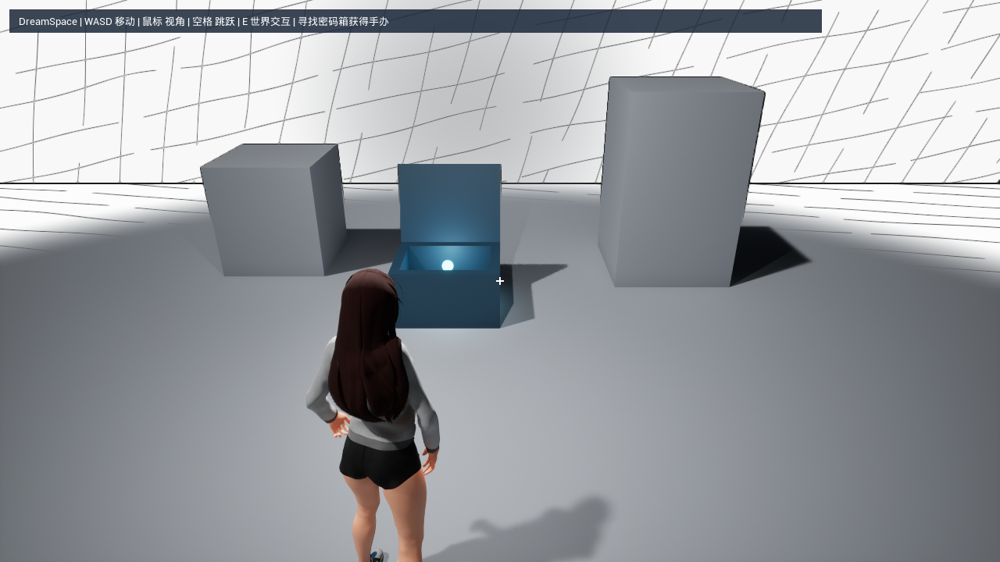

# 密码箱与手办解锁

玩家开局为空手：`ADreamCharacter.bHasMiniature` 初始为 `false`，手办显示面隐藏，SceneCapture 不做每帧捕获，Tab 不会进入观察。密码箱输入正确后依次开盖、显示箱内光点、自动吸取；只有光点实际抵达玩家才设置持有状态并启用原有手办。

## 直接体验

1. 编译并重新打开工程，打开 `/Game/DreamInteraction/PasswordChest/L_PasswordChestExample`。
2. 点击 PIE，准星对准箱子，必要时稍微向下调整视角，按 **E**。
3. 输入 **1234**，按 **Enter**。错误密码会提示重试，不会开盖。
4. 盖子打开后，光点在箱内停留 0.35 秒，随后自动飞向玩家；无需再按拾取键。
5. 出现“已获得手办，按 Tab 观察”后，按 **Tab** 验证原有居中观察、右键旋转及左键机关交互。

输入支持主键盘和小键盘的 0–9，Backspace 删除，E / Esc 取消。PIE 中建议再次按 E 关闭面板，Esc 可继续保留编辑器的停止运行快捷键。四位数字填满后仍需 Enter 确认；数字长按不会自动重复。面板期间禁止主动移动、转视角、跳跃、滚轮缩放、E 世界交互和 Tab 观察。重力、已经发生的下落和平台搬运继续运行。

## 放入自己的关卡

从内容浏览器拖入 `/Game/DreamInteraction/PasswordChest/BP_DreamPasswordChest`，或从 C++ 类拖入原生 **Dream Password Chest**。原生 Actor 自带中空占位箱体、独立盖子、发光球和点光源，蓝图示例增加了深色箱体及蓝色光点材质。

正式关卡需要使用现有 `MainGameMode` / `DreamCharacter` / `DreamPlayerController` / `DreamHUD`。手办内取景仍按已有文档放置 `DreamSceneCaptureAnchor`；密码箱不会重新布置真实建筑或改变锚点配置。

| 详情面板配置 | 默认值 | 用途 |
| --- | --- | --- |
| 四位数字密码 `UnlockPassword` | `1234` | 字符串，允许 `0007`；严格拒绝空格、符号、字母和全角数字 |
| 交互距离 `InteractionDistance` | 450 cm | 从角色胶囊中心计算；E 射线仍从相机检测 600 cm 并遵守首个阻挡物 |
| 开盖时长 `OpeningDuration` | 0.8 秒 | 盖子绕铰链平滑打开 |
| 开盖角度 `OpenAngle` | 105° | 绕 `LidPivot` 局部 X 轴旋转，模型轴向相反时可设负值 |
| 拾取前停留 `PickupDelay` | 0.35 秒 | 完全开盖后展示光点的时间 |
| 吸取时长 `AttractionDuration` | 0.65 秒 | 光点飞向玩家手办位置的时间 |
| 吸取弧线高度 `AttractionArcHeight` | 45 cm | 沿箱子局部上方形成弧线，0 为直线 |

输入非法密码配置会在日志中提示，箱子保持上锁。时间设为 0 时允许即时完成对应阶段，不需要蓝图 Timeline。

## 替换美术模型

- `BaseMesh` 和 `SideMeshes` 是默认底板与四面侧板，可在蓝图子类替换或隐藏；替换后的箱体须阻挡控制器交互通道，默认 Visibility。
- `LidPivot` 是铰链，`LidMesh` 是盖子；分别调整相对位置，保证模型绕真正的合页旋转。父子层级和 Movable 状态必须保留。
- `GlowRoot` 决定箱内光点的位置和大小，`GlowMesh` / `GlowLight` 随它一起飞向玩家。可以把自定义 Niagara 特效附加在 `GlowRoot` 下，沿用隐藏/显示与吸取生命周期。
- `OnChestUnlocked` 蓝图事件用于开锁音效；`OnMiniatureCollected(Character)` 用于成功领取音效或剧情事件。后者触发时箱子已标记已领取，角色已持有手办。

箱体原点位于箱底，默认尺寸约 90×70×58 cm，盖子向局部 +Y 方向抬起。盖子忽略 Pawn 和 Camera 碰撞，避免运动盖子把角色弹飞；静止侧板和底板保留实体碰撞。

## 状态与清理

`Locked → Opening → AwaitingPickup → Attracting → Collected`。箱子只能发放一次手办，重复输入、重复 E 或重复授予不会刷新获得提示。

密码输入使用控制器弱引用保存箱子和角色。取消、走出范围、ViewTarget 切换、失去 Pawn、视口失焦、箱子移除或退出关卡都会关闭面板，并仅释放当前会话添加的一次移动/视角忽略计数。其它系统已有的输入锁继续有效，按键释放仍交给引擎，避免 WASD 粘滞。

开盖或吸取中途如果失去原来的角色，箱盖保持打开，未领取光点回到箱内。新角色对打开的箱子按 E 可以继续自动吸取，无需再次输入密码。若箱子在领取前被关卡卸载，当前角色不会提前获得奖励。

当前持有状态保存在角色实例中，与现有钥匙一致；重新生成角色或重新启动 PIE 时重新解锁。此改动不增加存档、跨关卡背包或多人网络同步。

## 实现位置

- `Source/DreamSpace/Public/Puzzle/DreamPasswordChest.h` 与对应 `.cpp`：箱体、严格密码校验、开盖和光点吸取。
- `Source/DreamSpace/Private/Gameplay/DreamPasswordEntry.cpp`：输入缓冲、四位数字按键及模态会话清理。
- `DreamCharacter`：持有状态和 `AcquireMiniature()`；在组件 BeginPlay 前同步初始显示状态，兼容旧角色蓝图保存过的启用值。
- `DreamPlayerController`：世界 E 射线支持 Actor 自身实现 `DreamInteractableInterface`，优先处理 Actor 接口；原有组件交互继续使用原分发路径。
- `DreamHUD`：四格输入面板、错误反馈、解锁前操作提示和三秒获得提示。

原有手办观察/取出/魔方测试已明确准备“已获得手办”的前置状态，新密码箱套件单独验证开局为空手。

## 自动化与视觉验收

逻辑入口 `DreamSpace.Puzzle.PasswordChest` 包含四项测试，覆盖：开局隐藏与 Tab 门禁、真实 E 射线及墙体遮挡、主键盘/小键盘和前导零、错误密码、取消/距离/观看目标/销毁/换角色的输入锁清理、开盖和吸取时序、领取时机、重复领取、失去操作者后恢复奖励、不同帧率与零时长配置。

`DreamSpace.Presentation.PasswordChest.GameplayRender` 在独立示例关卡的真实游戏主视口导出开局、密码面板、开盖、光点吸取、获得提示和 Tab 观察截图。渲染检查仅改变本次游戏进程，不保存关卡。

```powershell
& 'E:\Epic Games\UE_5.8\Engine\Build\BatchFiles\Build.bat' DreamSpaceEditor Win64 Development '-Project=F:\Ue5 Project\DreamSpace-interactions\DreamSpace.uproject' -WaitMutex -NoHotReloadFromIDE -NoUBA -UBANoDetour -nocache
& 'E:\Epic Games\UE_5.8\Engine\Build\BatchFiles\Build.bat' DreamSpace Win64 Development '-Project=F:\Ue5 Project\DreamSpace-interactions\DreamSpace.uproject' -WaitMutex -NoHotReloadFromIDE -NoUBA -UBANoDetour -nocache
& 'E:\Epic Games\UE_5.8\Engine\Binaries\Win64\UnrealEditor-Cmd.exe' 'F:\Ue5 Project\DreamSpace-interactions\DreamSpace.uproject' /Engine/Maps/Entry '-ExecCmds=Automation RunTests DreamSpace' '-TestExit=Automation Test Queue Empty' -unattended -nop4 -nosplash -nullrhi '-ReportExportPath=F:\Ue5 Project\DreamSpace-interactions\Saved\Automation\PasswordChestRegressionFinal' '-abslog=F:\Ue5 Project\DreamSpace-interactions\Saved\Logs\PasswordChestRegressionFinal.log'
& 'E:\Epic Games\UE_5.8\Engine\Binaries\Win64\UnrealEditor.exe' 'F:\Ue5 Project\DreamSpace-interactions\DreamSpace.uproject' /Game/DreamInteraction/PasswordChest/L_PasswordChestExample -game -RenderOffscreen -d3d12 -ResX=1280 -ResY=720 '-ExecCmds=Automation RunTests DreamSpace.Presentation.PasswordChest.GameplayRender' '-TestExit=Automation Test Queue Empty' -unattended -nosplash -nosound -Multiprocess '-abslog=F:\Ue5 Project\DreamSpace-interactions\Saved\Logs\PasswordChestRender.log'
```

示例资源的可重复生成工具为 `Documents/Tools/GeneratePasswordChestExample.py`，只创建缺失的专用资源，保留已有同名资源的用户调整：

```powershell
& 'E:\Epic Games\UE_5.8\Engine\Binaries\Win64\UnrealEditor-Cmd.exe' 'F:\Ue5 Project\DreamSpace-interactions\DreamSpace.uproject' -run=pythonscript '-script=F:/Ue5 Project/DreamSpace-interactions/Documents/Tools/GeneratePasswordChestExample.py' '-EnablePlugins=PythonScriptPlugin,EditorScriptingUtilities' -unattended -nop4 -nosplash -nullrhi -nosound -Multiprocess
```

最终仍需在正式关卡 PIE 验收密码箱摆放距离、替换模型后的铰链方向、光点亮度和运动手感，以及取得手办后的右键旋转、左键操作和窗口失焦行为。

2026-10-11，UE 5.8.2，Win64 Development：编辑器和游戏目标编译通过，完整 `DreamSpace` 逻辑套件 64 项通过，新增四项密码箱测试没有警告。完整套件包含原有魔方自定义角块测试的一条初始化警告。最终逻辑报告位于 `Saved/Automation/PasswordChestRegressionFinal/index.json`。

独立 D3D12 游戏进程的 `GameplayRender` 通过，七张 1280×720 主视口截图位于 `Saved/Screenshots/PasswordChest/`，已检查密码面板、开盖、箱内光点、吸取中途、实际领取与 Tab 观察。渲染报告为 `Saved/Automation/PasswordChestRender/index.json`，验收截图不替代真实鼠标操作和窗口焦点手感测试。


