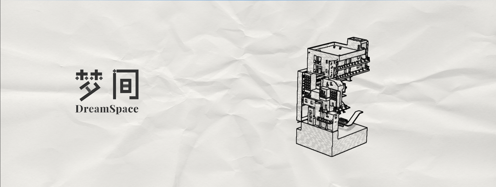

# 梦间开始界面

打开 `/Game/DreamPresentation/MainMenu/Maps/L_DreamMainMenu` 并运行即可查看。游戏默认启动地图和编辑器启动地图都已设为此关卡。左侧为保留原造型的石墨灰 Logo，右侧建筑以 **2°/秒**缓慢自转，背景为用户提供的浅皱 A4 纸。没有按钮或开始提示文字；点击画面任意位置，整幅画面在 0.65 秒内淡出，然后进入 `/Game/0_/Maps/TEST`。Enter、空格、触摸和手柄底部确认键也可开始，Esc、滚轮和鼠标移动不会误触。



## 结构与资源

菜单复制已保存的 `L_WhiteOutlinePreview` 中的 29 个可见网格和白材质覆盖。新关卡只有展示网格、灯光、后处理和菜单相机，不包含原关卡的机关逻辑。`TEST` 与原线稿／白盒预览仍使用各自的资源。

| 资源／代码 | 职责 |
| --- | --- |
| `ADreamMainMenuScene` | 建筑转轴、固定相机、按窗口比例计算的全周取景、动态排线坐标 |
| `ADreamMainMenuGameMode` | 选择菜单控制器和相机，不生成 Pawn/HUD；继承预览的临时 FXAA 管理 |
| `ADreamMainMenuPlayerController` | 全屏 Slate 点击、Logo、淡入淡出、一次性地图跳转 |
| `Materials/M_MenuHatching`、`MI_MenuHatching` | 复制现有手绘效果，额外支持建筑局部排线坐标 |
| `Materials/M_MenuPaper`、`MI_MenuPaper` | 描边和平滑后统一叠加纸纹，白色建筑与空背景使用同一纸面 |
| `Textures/T_MenuLogo`、`T_MenuPaper` | 整理后的 Logo 和纸张，随关卡打包，无需外部素材文件 |
| `RawContent/MainMenu` | 整理后的 PNG 与来源记录，可用于重新导入 |

排线位置和投影法线会逆旋转到建筑的初始坐标，笔划跟随墙面，光照明暗仍使用世界法线。相机与转轴是兄弟组件，建筑旋转时相机固定。取景按包围盒旋转扫过的圆柱计算，窗口变化时重算相机距离和偏心布局；窄窗口自动改为 Logo 在上、建筑在下。

## 调整

在关卡中选中 `MainMenu_BuildingAndCamera`：

| 属性 | 默认值 | 作用 |
| --- | --- | --- |
| `RotationSpeed` | 2°/秒 | 180 秒转一圈；0 停止、负数反向 |
| `bLogoOnRight` | false | 横屏时把 Logo 和建筑左右互换 |
| `BuildingHalfExtent` | 脚本记录的半尺寸 | 取景范围；更换建筑布局后应重新生成 |
| `LogoTexture` | `T_MenuLogo` | 更换透明 Logo |

打开 `MI_MenuPaper` 可以覆盖 `PaperStrength`（默认 0.48）和 `PaperTint`（轻暖白），降低浓度可减弱褶皱。打开 `MI_MenuHatching` 可以调整与原预览相同的描边、排线和阴影参数。建筑局部坐标参数由运行时自动更新。

Logo 使用原透明轮廓，深色主笔与浅色装饰转换为接近的石墨灰。纸张选自 `M}CJ~C9~7K24I8~Q8YIME62.jpg`，旋转、裁切成横向并压低摄影阴影对比。所有新增代码、着色器和脚本包含中文说明。

## 重新生成

以下命令在项目根目录运行。普通 Python 需要 Pillow 和 NumPy；美术来源默认在项目旁边的 `_assets`，也可传 `--assets` 指定。脚本只写整理后的 PNG，不覆盖原图。

```powershell
python Source/MainMenu/prepare_main_menu_art.py
& 'E:\Epic Games\UE_5.8\Engine\Build\BatchFiles\Build.bat' DreamSpaceEditor Win64 Development `
  '-Project=F:\Ue5 Project\DreamSpace-UI\DreamSpace.uproject' -WaitMutex -NoHotReload
& 'E:\Epic Games\UE_5.8\Engine\Binaries\Win64\UnrealEditor-Cmd.exe' `
  'F:\Ue5 Project\DreamSpace-UI\DreamSpace.uproject' -run=pythonscript `
  '-script=F:/Ue5 Project/DreamSpace-UI/Source/MainMenu/generate_main_menu.py' `
  '-EnablePlugins=PythonScriptPlugin,EditorScriptingUtilities' `
  -unattended -AllowCommandletRendering -nosound
```

生成器读取已保存的白色预览，写入 `/Game/DreamPresentation/MainMenu`，重建菜单地图与专用材质。重新生成会覆盖菜单内的手动调整，先保留要继续使用的值。报告在 `Saved/MainMenu/generation_report.json`。`DefaultGame.ini` 明确将菜单和动态跳转目标 `TEST` 加入烘焙列表。

## 验收

```powershell
& 'E:\Epic Games\UE_5.8\Engine\Binaries\Win64\UnrealEditor-Cmd.exe' `
  'F:\Ue5 Project\DreamSpace-UI\DreamSpace.uproject' `
  '-ExecutePythonScript=F:/Ue5 Project/DreamSpace-UI/Source/MainMenu/capture_main_menu.py' `
  '-EnablePlugins=PythonScriptPlugin,EditorScriptingUtilities' -unattended -nosound -NoSplash
```

这是独立验收编辑器，完成后自动退出。脚本在 PIE 中拍摄包含 Slate Logo 的真实游戏视口、旋转后画面与淡出画面，通过 Slate 命中检测在 `(0.96, 0.96)` 右下留白处模拟左键，然后核对 `TEST`、游玩控制器、角色、鼠标和抗锯齿恢复。报告与截图在 `Saved/MainMenu`。开发验收命令只编译进 `WITH_DEV_AUTOMATION_TESTS`，Shipping 不提供这些命令。

自动化套件 `DreamSpace.MainMenu` 包含两个有独立依据的测试：

- `CameraFitsFullRotation`：16:9、4:3、21:9、2:3 比例，左右两种布局，360° 每隔 5° 投影包围盒角点，确认全程在建筑区域内。
- `BuildingRotatesCameraStaysFixed`：瞬时世界内挂载实际子 Actor，30 秒转动 60°，同时检查相机变换没有随主体运动。

2026-10-10，UE 5.8.2：编辑器和游戏 Development 编译通过，两个自动化测试全部通过。菜单两个专用材质重新加载／重编译无错误；真实截图确认 Logo、纸纹、轮廓与排线可见；约 5 秒从 12.04° 转到 21.87°；右下留白点击成功；跳转后生成 `DreamPlayerController` / `DreamCharacter`，光标隐藏，抗锯齿为 `4 → 1 → 4`。源 `TEST` 和 `L_WhiteOutlinePreview` 文件哈希与修改前相同。

本次未制作完整打包产物。`TEST` 本身存在旧素材缺贴图／缺少部分嵌套蓝图的警告，菜单白材质覆盖不使用这些缺贴图材质。最终请在编辑器运行菜单，主观确认旋转速度、纸纹浓度和 Logo／建筑的画面比例。
