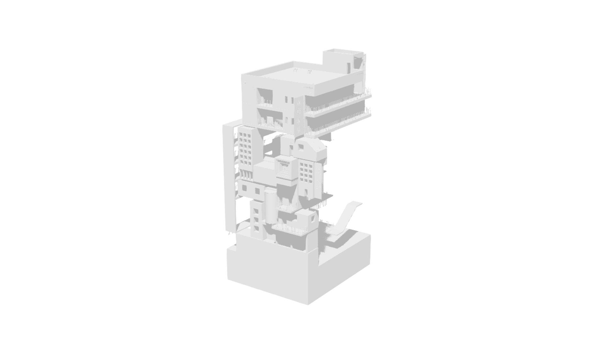

# 白盒建筑预览

这是与铅笔线稿并存的独立视觉方案。它把 `TEST` 中当前可见的建筑复制为静态预览，使用无贴图的白色表面、均匀浅灰块面和柔和投影，背景为纯白，画面只包含黑白灰。

当前版按干净白模的方向调整：移除了所有屏幕空间面边缘渐变和描边，关闭环境遮蔽、Lumen 间接光及局部曝光，避免窗框、栏杆等密集细节叠成灰雾。立体感来自实际主光与几何法线；少量均匀补光托起背面，灰度后处理限制最深阴影并抬亮画面。风格参考用户描述的《卡拉彼丘》早期加载界面，但尚未取得能确认版本的原始参考，具体相似度需由用户验收。

## 查看

在 UE 内容浏览器打开 `Content/DreamPresentation/WhiteBoxPreview/Maps/L_WhiteBoxPreview`，点击“运行”。关卡使用预览专用 GameMode、固定相机，不生成角色和 HUD。



本版本只做视觉预览，没有标题、开始提示、旋转或源关卡的解谜逻辑。原建筑的网格和原材质不被修改，材质覆盖只作用于预览关卡内的复制组件。

## 资源

| 资源 | 用途 |
| --- | --- |
| `Materials/M_WhiteBoxSurface` | 双面、粗糙、非金属的白色建筑表面 |
| `Materials/M_WhiteBoxBackground` | 纯白无纹理环境，参与正常抗锯齿，不投影 |
| `Materials/M_WhiteBoxPost` | 只读取场景颜色的灰度提亮与阴影下限 |
| `Materials/MI_WhiteBoxPost` | 白盒参数实例 |
| `Maps/L_WhiteBoxPreview` | 白盒建筑静态快照和固定取景 |

打开 `MI_WhiteBoxPost` 可以调节：

| 参数 | 默认值 | 作用 |
| --- | --- | --- |
| `ShadowFloor` | 0.68 | 最深阴影的灰度下限，越高越白，越低对比越强 |
| `WhitePoint` | 1.0 | 场景亮度达到此值后输出纯白，过低会让亮面融入背景 |
| `MidtoneLift` | 1.0 | 小于 1 时抬亮中间调，侧面和柔影仍来自实际光照 |

`M_WhiteBoxSurface` 中的 `FillBrightness` 默认 `0.025`，提供均匀白色补光。它不产生辉光，也不照亮相邻物体。关卡的 `WhitePreview_KeyLight` 默认强度 `2.0`、光源角度 `5.0`，旋转为 `Pitch=-55, Yaw=60, Roll=0`；调节光源方向可改变块面明暗和投影。

白色背景使用包围建筑与相机的环境网格，它与建筑一起经过引擎抗锯齿。后处理不读取深度或法线、不采样邻点，所以不会在色调映射后重新裁出硬轮廓，也不会在细小结构周围生成晕圈。环境网格关闭碰撞、投影、距离场照明和光线追踪可见性，只承担白底。

## 重新生成

在当前项目根目录运行。脚本依赖同目录的 `generate_white_preview.py`。默认增量更新白盒材质、灯光和后处理，保留现有建筑快照及相机；参数会恢复脚本默认值，手动调参后请先保留自己的实例或关卡副本。首次运行会创建快照，需要重新读取 `TEST` 时可为 `-script` 参数的脚本路径追加 ` --rebuild`。

```powershell
$previewProjectRoot = (Get-Location).Path
$previewProject = Join-Path $previewProjectRoot 'DreamSpace.uproject'
$previewGenerator = (Join-Path $previewProjectRoot 'Source/WhitePreview/generate_white_box_preview.py').Replace('\', '/')
& 'E:\Epic Games\UE_5.8\Engine\Build\BatchFiles\Build.bat' DreamSpaceEditor Win64 Development "-Project=$previewProject" -WaitMutex -NoHotReload
& 'E:\Epic Games\UE_5.8\Engine\Binaries\Win64\UnrealEditor-Cmd.exe' `
  $previewProject `
  -run=pythonscript `
  "-script=$previewGenerator" `
  '-EnablePlugins=PythonScriptPlugin,EditorScriptingUtilities' `
  -unattended -AllowCommandletRendering -nosound -stdout
```

生成报告写入 `Saved/WhitePreview/white_box_generation_report.json`。真实渲染截图和 PIE 验收：

```powershell
$previewCapture = (Join-Path $previewProjectRoot 'Source/WhitePreview/capture_white_box_preview.py').Replace('\', '/')
& 'E:\Epic Games\UE_5.8\Engine\Binaries\Win64\UnrealEditor.exe' `
  $previewProject `
  "-ExecutePythonScript=$previewCapture" `
  '-EnablePlugins=PythonScriptPlugin,EditorScriptingUtilities' `
  -unattended -nosound -NoSplash
```

脚本在单独启动的编辑器中渲染 1920x1080 和 1280x720 截图，再运行 PIE 验证相机、GameMode 及无角色/HUD，结束后自动关闭该编辑器。截图为 `Saved/WhitePreview/WhiteBoxPreview.png` 和 `WhiteBoxPreview_1280x720.png`，验收报告为 `Saved/WhitePreview/white_box_capture_report.json`。报告同时记录材质编译错误、实例参数、白色环境、建筑数量和启用的后处理。

当前默认资源已通过 UE 5.8.2 的三个专用材质重编译和 PIE 检查。两种分辨率均为严格灰度、边缘画布为纯白，建筑完整入镜；1080p 底座正面、侧面和屋顶的灰度抽样分别为 226、214、236，能够区分主要块面。验收结果只确认渲染与运行正常，风格是否符合预期仍以实际画面为准。
