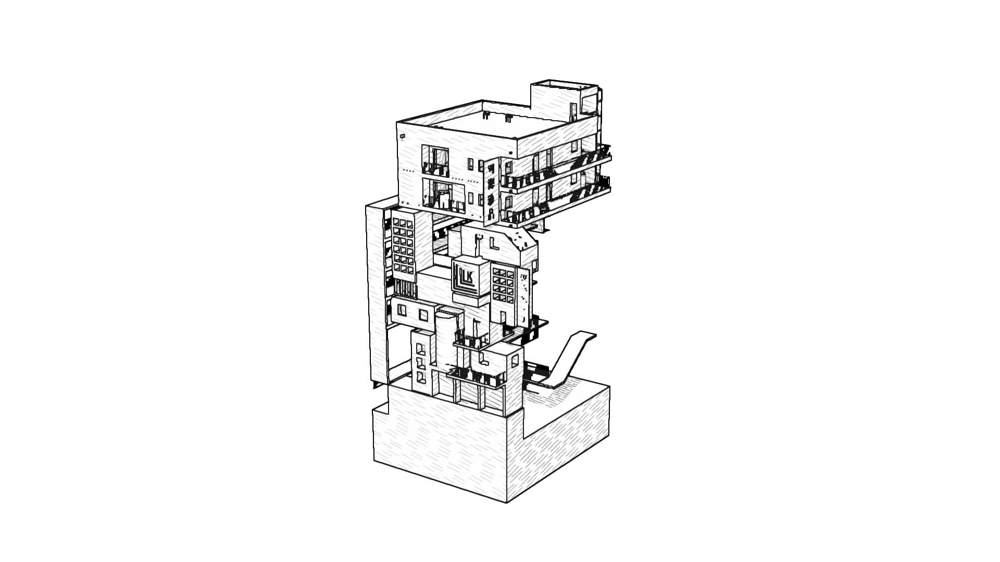

# 白色建筑手绘排线预览

独立展示关卡使用 `TEST` 中的 29 个可见建筑网格，呈现纯白背景、稳定黑色轮廓和按明暗变化的手绘排线。亮面留白，中间调使用单向笔划，阴影逐渐增加交叉线，最深暗部再增加一层笔划。风格依据用户提供的《Real-Time Rendering》截图右侧的表面排线效果。

当前版本的手绘感来自阴影笔划的轻微弯曲、接笔和笔压差异。轮廓没有时间位移，不需要等待动画或调节摆动速度。

## 查看效果

1. 在 UE 内容浏览器打开 `Content/DreamPresentation/WhitePreview/Maps/L_WhiteOutlinePreview`。
2. 点击“运行”，专用 GameMode 会使用固定相机，不生成角色或 HUD。
3. 编辑器中自由查看时使用“光照”模式，并确认后处理显示开启；按 `G` 可隐藏图标。右键 `WhitePreview_Camera` 选择“驾驶”可查看固定构图。

运行时会临时使用 FXAA，避免 TSR 的逐帧深度采样抖动影响细结构线；退出预览后恢复进入前的抗锯齿设置。此开关由后处理体积的 `DreamWhiteHatchingPreview` 标签控制，白盒方案没有此标签。编辑器自由查看时若细线闪动，可在控制台输入 `r.AntiAliasingMethod 1`；返回其他关卡后按项目设置恢复，例如 TSR 为 `r.AntiAliasingMethod 4`。



仅实现展示效果，不包含标题、点击开始或建筑旋转。关卡是静态快照，复用原网格并覆盖复制组件的材质槽。`TEST`、源网格默认材质、解谜蓝图、项目默认启动地图及另一套 `WhiteBoxPreview` 不受本次更新影响。

## 资源与调节

资源位于 `/Game/DreamPresentation/WhitePreview`。

| 资源 | 用途 |
| --- | --- |
| `Materials/M_WhiteArchitecture` | 双面、非金属、高粗糙度白色表面，保留几何法线并支持 Nanite |
| `Materials/M_WhiteOutlinePost` | 纯白画布、深度／法线描边、明暗驱动的表面排线 |
| `Materials/MI_WhiteOutline` | 关卡使用的实例，主要视觉参数在这里调节 |
| `Materials/M_WhiteOutlineAA` | 描边与排线生成后的方向抗锯齿 |
| `Materials/MI_WhitePencil` | 保留已有资源路径，目前仅提供 `SmoothingStrength`，默认 1 |
| `Maps/L_WhiteOutlinePreview` | 建筑快照、灯光、后处理体积和固定相机 |

打开 `MI_WhiteOutline`，勾选参数的覆盖开关再修改。优先调节排线间距、强度和阴影明暗。

| 排线参数 | 默认值 | 作用 |
| --- | --- | --- |
| `HatchStrength` | 0.88 | 排线整体浓度；0 关闭排线 |
| `HatchSpacing` | 48 cm | 世界表面的基础线间距；增大更疏、更容易看清单条笔划 |
| `HatchWidth` | 0.85 px | 最终输出像素的笔划宽度；远处用导数过滤减少摩尔纹 |
| `HatchAngle` | 12° | 主笔划相对投影面的角度；交叉层再偏转 60° |
| `HatchIrregularity` | 0.12 | 固定的排间偏差与笔划弯曲幅度，以间距比例表示 |
| `HatchStrokeLength` | 6 | 单段笔划长度，以基础间距倍数表示；各排错开接笔位置 |
| `ShadowInfluence` | 0.6 | 实际白色场景亮度的权重，其余来自法线受光 |
| `ShadowReference` | 0.72 | 受光白面的显示亮度参考；低于参考逐渐增加排线 |
| `HatchToneBias` | 0.02 | 明暗留白偏移；增大可让更多表面保持白色 |
| `HatchToneContrast` | 1.0 | 明暗对比；增大更早出现交叉排线 |
| `HatchDebugView` | 0 | 0 完整效果，1 明暗依据，2 仅排线，3 原始白模光照；正常使用保持 0 |

| 描边参数 | 默认值 | 作用 |
| --- | --- | --- |
| `SilhouetteWidth` | 1.15 px | 外轮廓采样半径 |
| `StructureWidth` | 0.95 px | 墙角、台阶和遮挡边缘的采样半径 |
| `StructureStrength` | 0.9 | 内部结构线的墨色浓度 |
| `NormalThreshold` | 0.25 | 提高后只保留更明显的法线转折 |
| `DepthThreshold` | 0.006 | 提高后过滤更浅的遮挡细节 |
| `ShadingStrength` | 0.035 | 排线之间的辅助浅灰；0 为纯白纸面 |
| `StrokeVariation` | 0.08 | 固定的线宽变化；0 恢复等宽，不随时间变化 |
| `LineOpacity` | 1 | 所有轮廓与结构线的整体浓度 |
| `InkColor` | 接近黑色 | 轮廓墨色 |
| `LightDirection` | (-0.36869, -0.52654, 0.76604) | 表面指向主光的世界方向，须与实际方向光同步 |
| `MaxSubjectDepth` | 1000000 cm | 超过此距离视为白背景 |

预览方向光 `WhitePreview_KeyLight` 使用 `Pitch=-50, Yaw=55, Roll=0`，强度为 3，光源角度为 5°。如果手动转动方向光，应同时更新 `LightDirection`；它是方向光朝向向量的反方向。

需要更轻的画面时，先增加 `HatchToneBias` 或降低 `HatchStrength`。希望阴影更像细长笔划时，增大 `HatchSpacing`，避免仅增加浓度。将 `HatchStrength`、`ShadingStrength` 和 `StrokeVariation` 设为 0，可以查看白底等宽描边。

## 实现方式与范围

`WhiteOutline.hlsl` 通过可见表面的绝对世界位置，在三个平面投影程序化排线，并根据法线混合。笔划不依赖模型 UV，也不读取或复制参考图的纹理。墙面和顶面的方向随面转折，相机改变时排线仍锚定于表面世界位置。将来如果让整个建筑旋转，应改为随展示主体运动的局部坐标。

明暗由几何法线受光和已经渲染的统一白色表面亮度共同决定。投影、凹处和接触暗部通过场景亮度影响排线密度；这不是直接读取独立阴影缓冲，密度也不是物理光照值。固定曝光用于保持菜单画面的明暗关系。

各层复用固定坐标，随明暗连续淡入。笔压变化、错开的接笔和轻微弯曲均为空间变化，没有 Time 节点。线间距投影到屏幕后过小时，过滤为平均覆盖率，减少密线的摩尔纹。

外轮廓和内部结构线仍由深度、几何法线识别，不绘制隐藏边或三角网格。倒数深度的二阶差分可减少倾斜墙面被误当作结构线的情况。专用关卡中的全部可见网格都参与效果，不要求全项目开启 Custom Depth／Stencil。

## 更新资源

已生成的关卡可直接使用。修改 HLSL 后，在项目根目录运行增量更新：

```powershell
& 'E:\Epic Games\UE_5.8\Engine\Binaries\Win64\UnrealEditor-Cmd.exe' `
  'F:\Ue5 Project\DreamSpace-UI\DreamSpace.uproject' `
  -run=pythonscript `
  '-script=F:/Ue5 Project/DreamSpace-UI/Source/WhitePreview/generate_white_preview.py --materials-only' `
  '-EnablePlugins=PythonScriptPlugin,EditorScriptingUtilities' `
  -unattended -AllowCommandletRendering -nosound
```

增量更新重建描边、排线和平滑材质，恢复实例默认参数，同步预览主光方向及后处理引用；保留网格、相机、白色表面和其他关卡设置。报告为 `Saved/WhitePreview/hatching_generation_report.json`。请在重跑前保留需要保留的手动调参。

需要重新读取 `TEST` 的建筑布局时，移除 `--materials-only`。完整生成会覆盖专用预览地图和材质，须先编译 `DreamSpaceEditor`。Python 插件只在命令行中启用，无需修改 `.uproject`。脚本路径使用正斜杠，避免 `\U` 被解释为 Python 转义。

## 渲染验收

```powershell
& 'E:\Epic Games\UE_5.8\Engine\Binaries\Win64\UnrealEditor-Cmd.exe' `
  'F:\Ue5 Project\DreamSpace-UI\DreamSpace.uproject' `
  '-ExecutePythonScript=F:/Ue5 Project/DreamSpace-UI/Source/WhitePreview/capture_white_preview.py' `
  '-EnablePlugins=PythonScriptPlugin,EditorScriptingUtilities' `
  -unattended -nosound -NoSplash
```

脚本使用真实渲染器，输出 1920×1080 和 1280×720 的完整画面、重复帧、关闭排线、明暗依据、仅法线明暗、仅排线和原始光照。随后明确恢复已保存实例及原抗锯齿设置，再运行 PIE，核对 GameMode、相机、后处理资源、调试参数及空 Pawn/HUD。PIE 在同一运行环境内采集完整、重复、关闭排线和仅排线对照，确认运行时抗锯齿切换到 FXAA，并检查结束 PIE 后恢复原值。截图期间的覆盖值仅写入临时动态实例，不保存关卡。完成后自动结束此次验收编辑器。不能加 `-nullrhi`。

截图和报告位于 `Saved/WhitePreview`：`WhiteHatchingPreview.png`、`WhiteHatchingPreview_PIE.png`、`hatching_capture_report.json`。在安装 Pillow 和 NumPy 的普通 Python 环境中运行：

```powershell
python Source/WhitePreview/verify_hatching_preview.py
```

检查包括排线对画面的实际贡献、实际光照对明暗的贡献、暗部笔划浓度高于亮部、重复帧稳定、完整 PIE 效果、截图尺寸及白背景。结果为 `hatching_pixel_report.json`，并裁出未经额外处理的 `WhiteHatchingDetail.png`。原始光照调试图允许引擎 GI 色偏；正式效果严格黑白灰。

UE 材质图编译返回成功不代表异步 GPU Shader 一定成功，应同时检查验收日志和像素结果。源网格引用的旧材质 `_Color_M09_1` 有缺贴图警告；预览实际使用新的白色表面材质。

最终主观验收请关注：排线是否像铅笔阴影、亮面是否有足够留白，以及栏杆和窗框在目标 UI 显示尺寸下是否清楚。

## 当前验证结果

2026-10-10，UE 5.8.2：`DreamSpaceEditor Win64 Development` 与 `DreamSpace Win64 Development` 编译通过。重新加载并编译实际使用的三个材质，无本次材质的 GPU 编译错误，Time 节点数均为 0。1080p 与 720p 真实截图、灰度及白色画布检查通过。

关闭排线后，1080p 有 69,890 个像素发生超过 8 灰阶的变化；改为仅法线明暗后，147,395 个像素的明暗依据发生变化，确认实际光照参与了排线。四档明暗中的平均笔划暗度依次约为 3.7、20.7、40.3、46.7，暗处比亮处更密。

正式编辑器重复帧平均差为 0.162 / 255，PIE 重复帧为 0.112 / 255。PIE 对照确认完整轮廓与面内排线都可见，后处理使用保存的实例，预览规则、相机和空 Pawn/HUD 正确。运行时抗锯齿实测为 `4 → 1 → 4`，结束 PIE 后恢复原设置。`TEST.umap` 与 `WhiteBoxPreview` 地图的 Git 文件哈希与更新前一致，白色表面材质未变。
